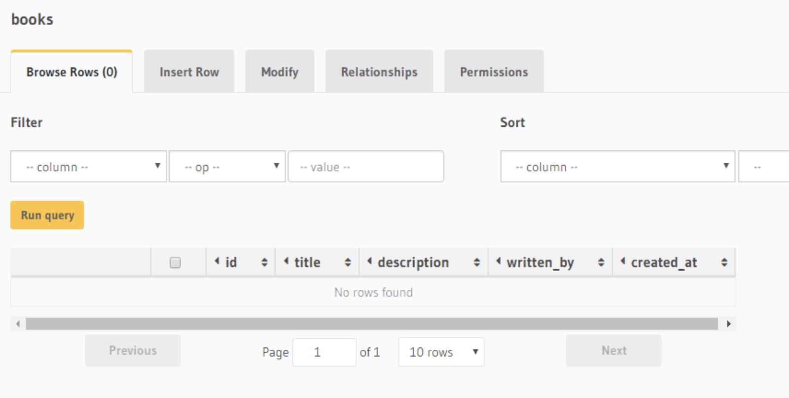
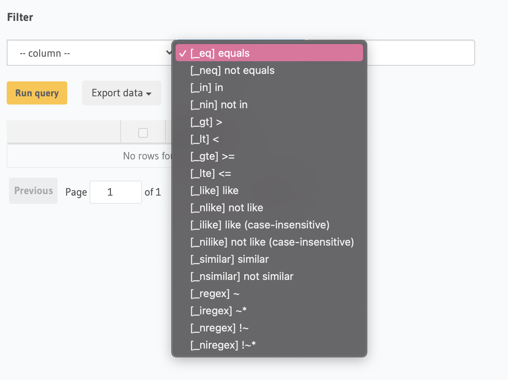
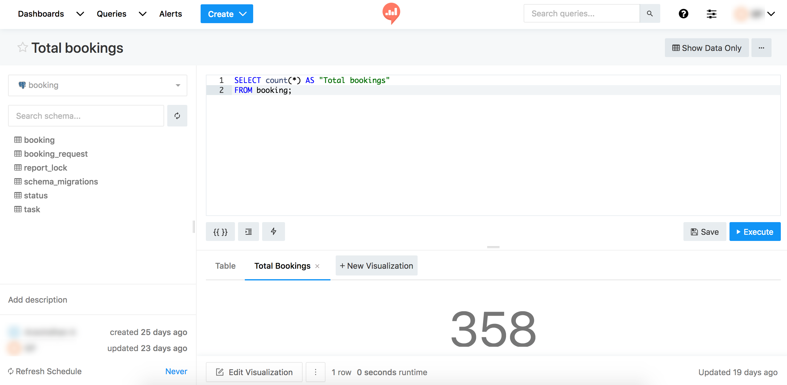
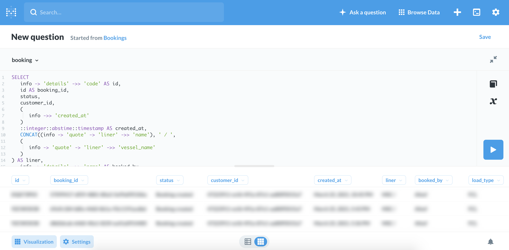
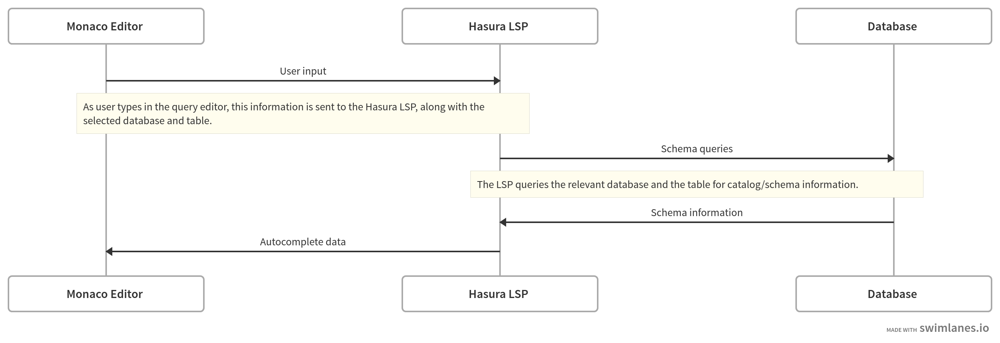

# RFC — Scaling a Web-Based Multi-Database Browser

The Hasura GraphQL engine connects to different kinds of databases like MySQL, PostgreSQL and MS SQL. APIs are available that will either let us send raw SQL or use auto-generated GraphQL for every table in the database selected.

The problem that this RFC tries to address is (emphasis mine) —

> How to do it in the best way so that it'll be scalable for **different databases** and will cover all of our functionalities (filter, sort), how can we have **type safety** if we don't have any information about schemas and tables in build time? 

## Background

The Hasura GraphQL Engine connects to customers' databases, and with the recent Hasura 2.0 release a single Hasura GraphQL Engine might be connected to multiple different databases and these databases might be different types (PostgreSQL, MySQL, MS Server, etc.)

In the console, we allow customers to browse the data in the databases they've connected to Hasura. The Browse Rows tab (see images below) allows them to view the data from a particular table in a particular database. We have information about column names, column types and other table details only in runtime, and the data might be stored in different types of databases. There are two kind of APIs that we can use:

- Raw SQL API — we can send any SQL query to the backend that will be executed on a particular database.

- GraphQL API — generated for all the tables.

We also let users to filter their data by various operators (depending on the type of the database). Users can also sort the data by column ascending or descending.

&nbsp;             |  &nbsp;
|-----------------------------|------------------------------------|
  |  

The goal is to try to scale this for newer future databases and have type-safety, while still maintaining all the querying capabilities.

## Motivation

[Engineers are building new databases everyday](https://www.infoworld.com/article/3563548/do-we-need-so-many-databases.html), thanks to newer high-performance languages, cheaper data storage costs, more domain-specific storage & retrieval charateristics and an increased proliferation of [NIH syndrome](https://en.wikipedia.org/wiki/Not_invented_here).

For Hasura's offerings to benefit more users and capture an even bigger market, it is imperative to support more databases.

As no two databases are alike, building a data querying experience that works equally well for all databases becomes a challenge. The below proposals attempt to offer some longer-term solutions.

## Proposals

### 1. Free-form query editor

The current experience of 3 input fields (column, operation and value) for executing queries would not scale well in a few cases —

1. When Hasura starts to support more databases; especially graph, KV or columnar databases.
2. When the user wishes to query spatial fields (like [GIS](https://postgis.net)) or composite fields (like the [`json` type in PostgreSQL](https://www.postgresql.org/docs/10/datatype-json.html)).

Other solutions that let users query databases and view results instantly, like [Redash](https://redash.io/) and [Metabase](https://www.metabase.com/), default to a free-form query editor so that it gives more power & flexibility to users and is easier to support multiple databases.

Redash             |  Metabase
|-----------------------------|------------------------------------|
  |  

#### **Implementation**

This implementation offers an even more powerful query editing experience than the examples linked above.

We use [Microsoft's Monaco Editor](https://microsoft.github.io/monaco-editor/) as the centerpiece of the query editing experience. It is the core text editing engine powering the very popular VSCode, and offers rich code syntax highlighting, hints, and autocomplete.

The Monaco editor can be provided with rich context-aware autocomplete via a custom [Language Server Protocol](https://microsoft.github.io/language-server-protocol/) (LSP) service. This LSP service will connect to the database the user has selected, pick up query-specific schema information and serve it to the frontend editor.

For example, say the user has selected the table `books` from the `library` database, and say the user begins to type this query —

```sql
SELECT 
```

The LSP service will query the schema for the `books` table and offer all columns from that table as options, which can be used by Monaco as suggestions.

The steps involved in implementing such an architecture are —

1. Build an implementation of the LSP for the databases that Hasura supports.

   Prior art — [`sqls`](https://github.com/lighttiger2505/sqls), a Go-based implementation of the LSP that supports PostgreSQL, MySQL and SQLite3.

2. Build a "connector" for Monaco on the frontend that can talk to the LSP service via a suitable protocol like WebSockets.

    Prior art — [Monaco language client](https://github.com/TypeFox/monaco-languageclient#monaco-language-client), a TypeScript project that makes it easy to connect a Monaco instance to a backend LSP service.


<!-- https://swimlanes.io/d/i_Bcaxe-2 -->
